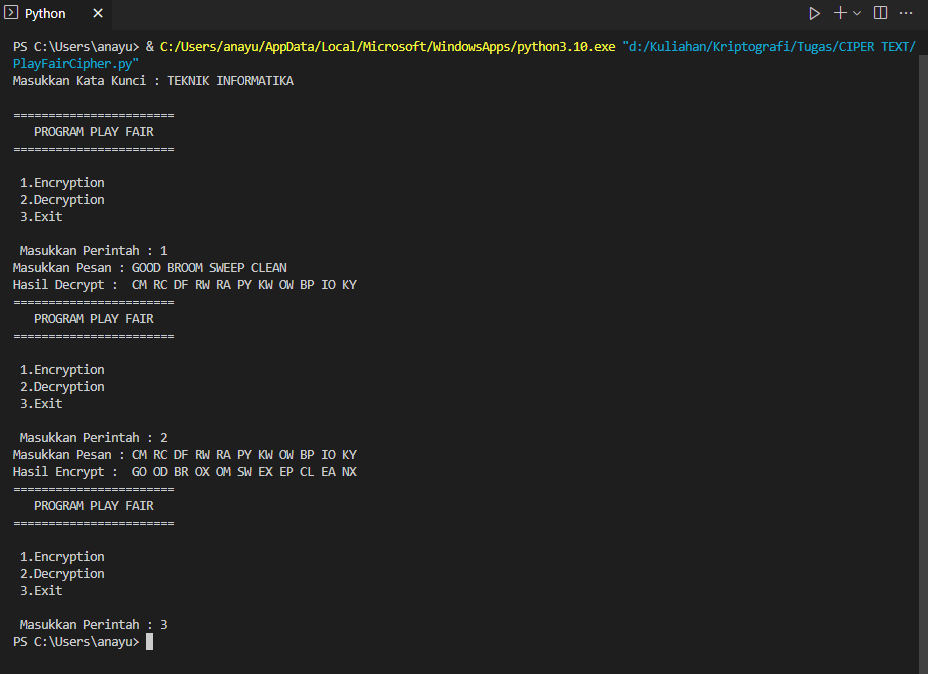
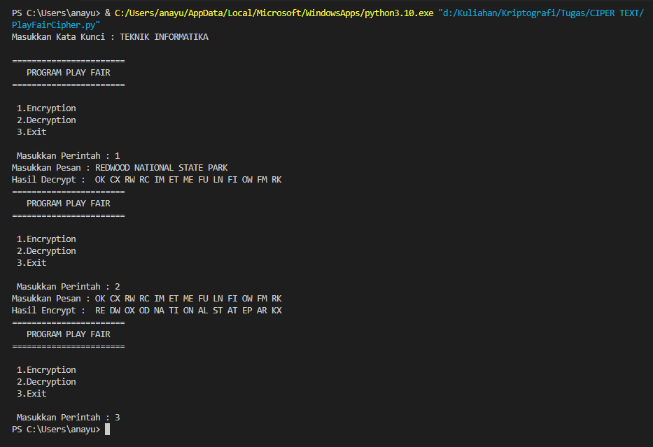
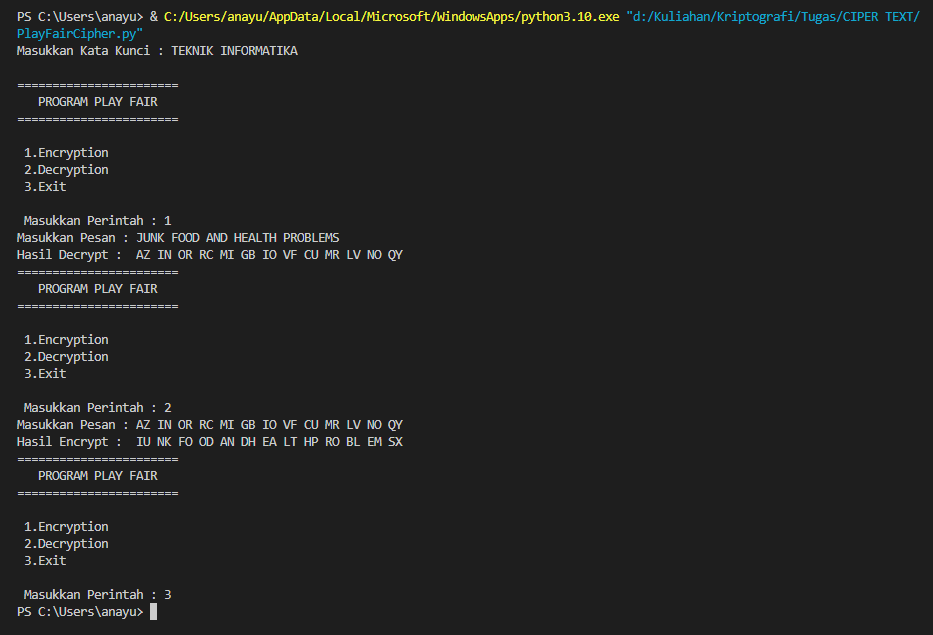

# Playfair Cipher

<table border="2" cellpading="10">
  <tr>
    <td><b>Nama</b></td>
    <td>MUHAMMAD SAFRI SATRIA PERMANA</td>
  </tr>
  <tr>
    <td><b>NIM</b></td>
    <td>312010337</td>
  </tr>
  <tr>
    <td><b>Kelas</b></td>
    <td>TI.20.A2</td>
  </tr>
  <tr>
    <td><b>MataKuliah</b></td>
    <td>Kriptografi</td>
  </tr>
  <tr>
    <td><b>Dosen Pengampu</b></td>
    <td>Ahmad Turmudizy,S.Kom.,M.Kom
</td>
</table>
 

- ;
   

- ;
   

- ;

